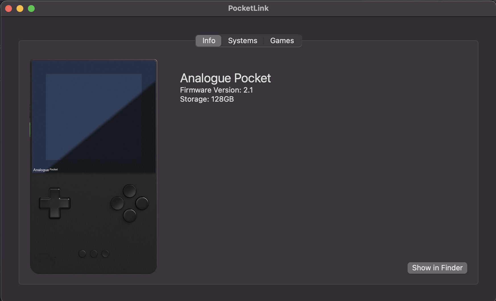
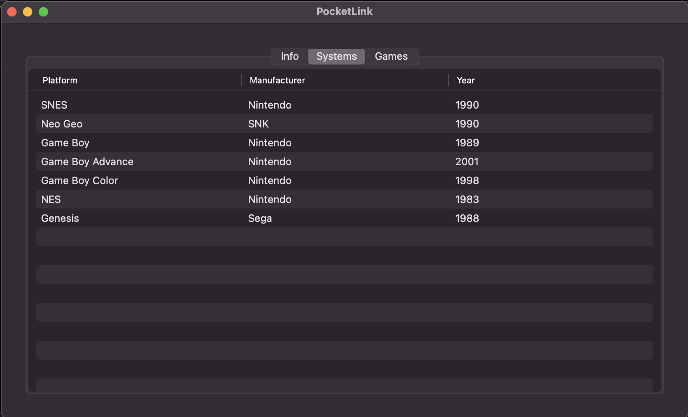
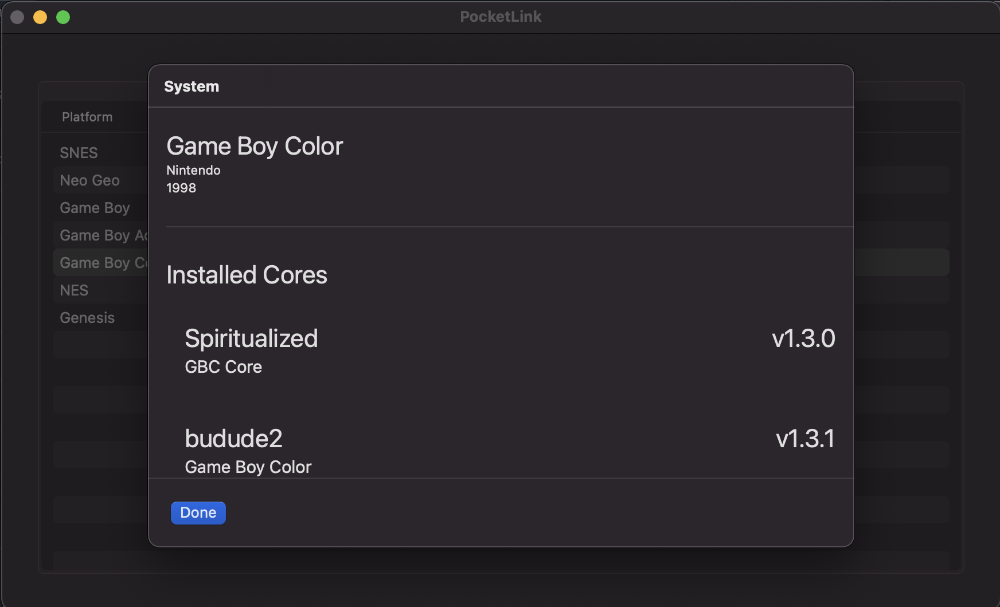

# PocketLink

**PocketLink**: an iTunes like utility for the Analogue Pocket.

## How to use

This tool only works when the device is plugged in over USB & the USB transfer option is enabled on the device

## Features

- View device information such as firmware version & disk space
- View all installed cores (adding cores yet to be implemented)
- View & backup all games & battery saves

## Screenshots

## Contributions

Contributions are welcome, some features I'd like to have but haven't added yet are:

- Disk utlization % on Summary page
- Core installer
- Export save states (a.k.a. memories)
- Any `TODO`s you find in code

## Disclaimer

This software is provided "as is," without warranty of any kind, express or implied, including but not limited to the warranties of merchantability, fitness for a particular purpose, and non-infringement. In no event shall the authors or copyright holders be liable for any claim, damages, or other liability, whether in an action of contract, tort, or otherwise, arising from, out of, or in connection with the software or the use or other dealings in the software.

You assume all responsibility and risk for the use of this software. The authors do not warrant that the software will be error-free or operate without interruptions. You are solely responsible for determining the appropriateness of using or distributing this software and assume any risks associated with your exercise of permissions under this license.
